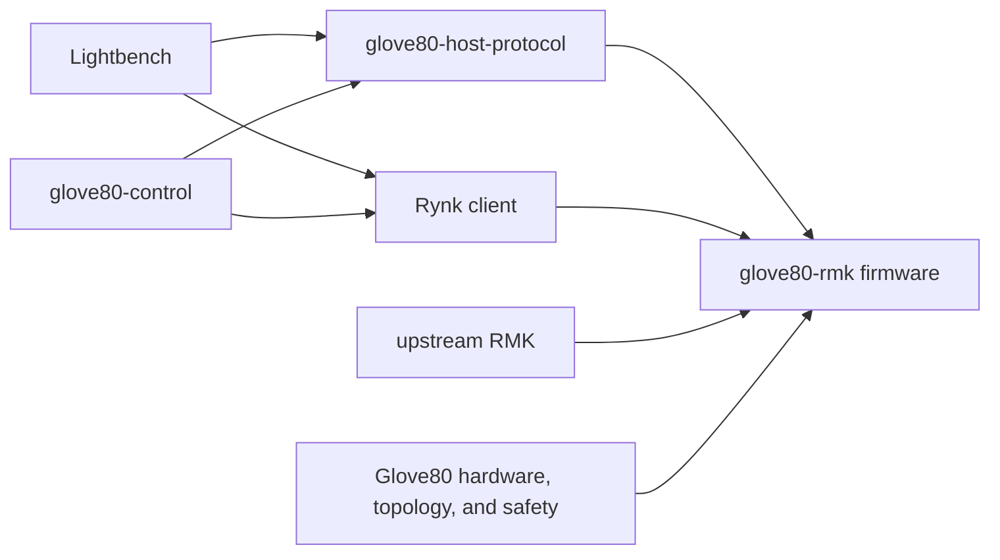

# Glove80 RMK repository design

Status: historical pre-extraction design record, imported verbatim from the
untracked source working tree except for this status note. Paths in the
migration stages describe the old `glove80-config` layout intentionally; the
current repository layout is documented in the root README.

## Decision summary

Use **`glove80-rmk`** for the project and Cargo package name.

There is no documented RMK naming standard. The official
[`rmk-template`](https://github.com/HaoboGu/rmk-template) accepts a project name
rather than imposing either `rmk-<keyboard>` or `<keyboard>-rmk`, and community
projects use both forms. `glove80-rmk` is preferable here because:

- the existing firmware package is already named `glove80-rmk`;
- it reads as “the Glove80 implementation using RMK” rather than an RMK fork or
  an upstream-owned Glove80 port;
- product-first naming keeps it adjacent to other Glove80 software and leaves
  room for components such as `glove80-control` and
  `glove80-host-protocol`; and
- changing the package name would create churn without establishing a real
  ecosystem convention.

`rmk-glove80` would also be understandable and may be slightly easier to find
in a framework-centric repository list, but GitHub topics and the repository
description solve that discovery problem without implying upstream ownership.

Create **a separate `glove80-rmk` Git repository now**. It should contain the
complete active RMK product stack: firmware, downstream lighting code, the
product protocol, control CLI, Lightbench UI, and the exact RMK dependency.
Keeping those tightly coupled components together avoids inventing premature
cross-repository releases while still giving the RMK implementation a clear
home.

The existing `glove80-config` repository remains the historical and recovery
home for the legacy ZMK and Zephyr-era implementation. The new repository must
not initially split the active RMK firmware from its host-side clients or copy
generic RMK framework code out of the pinned dependency.

## What “a standard RMK keyboard project” means

RMK's normal user workflow creates a standalone project using
[`rmkit init`](https://github.com/HaoboGu/rmkit) and the official template. The
nRF52840 split template is a small Rust project with:

- `.cargo/config.toml`;
- `Cargo.toml` (with an application `Cargo.lock` committed after generation);
- `keyboard.toml` and, when Vial is used, `vial.json`;
- `build.rs`, `memory.x`, and `rust-toolchain.toml`;
- central and peripheral binaries under `src/`; and
- a `Makefile.toml` or equivalent reproducible command that emits one image per
  half.

RMK does not maintain a QMK-style upstream directory containing every board.
A board using RMK is normally a downstream Rust firmware project. The current
`rmk/glove80` directory already follows most template conventions, but it is a
product-specific integration rather than a generic RMK example and should not
live in the upstream RMK repository.

The Glove80 project legitimately exceeds the template because it also needs a
custom LED driver and topology, persistent lighting policy, split application
messages, a product protocol, two host clients, and a temporarily patched RMK
dependency.

## Repository boundary

The repository should own the complete Glove80 RMK product stack. Upstream RMK
should own reusable keyboard-framework mechanisms; this repository should own
all Glove80 hardware and product policy.



The arrows are dependency or protocol relationships, not ownership transfer.
The firmware remains authoritative for runtime keyboard and lighting state.

### Upstream RMK owns

- keyboard scanning, actions, layers, host transport, storage primitives, and
  split-keyboard infrastructure;
- generic event subscription and processor/controller integration points;
- generic lighting topology, composition, scheduling, and driver interfaces if
  and when those are accepted upstream; and
- Rynk protocol definitions and reusable host libraries.

No Glove80 pins, LED counts, status meanings, flash addresses, current limits,
or product protocol commands belong in upstream RMK.

### The Glove80 firmware owns

- the left and right matrix pin maps and the logical 6-by-14 layout;
- both bootloader family IDs and the exact application/storage flash map;
- battery, power-button LED, WS2812 data, and WS2812 enable wiring;
- LED chain order, LED-to-key mapping, physical geometry, zones, and split
  routing;
- the MoErgo channel/current safety ceiling and driver-level enforcement;
- default keymap and layer-aware lighting scenes;
- product status policy, such as which LED communicates connection state;
- adaptation of RMK events and Rynk requests into the lighting service;
- product-protocol handling, persistence, and compatibility policy; and
- central/peripheral application-message semantics that have not moved into a
  generic upstream facility.

### Shared product crates own

- `glove80-host-protocol`: the bounded, transport-independent wire contract
  used by firmware, CLI, and browser tests;
- downstream lighting behavior that remains specifically Glove80 policy; and
- golden vectors and compatibility fixtures shared by host and device code.

A generic compositor should migrate to RMK or a separately reusable crate.
Glove80 default scenes, safety constraints, topology, status policy, and
protocol adapters remain downstream even after that migration.

### Host applications own

- transport discovery and framing at the operating-system/browser boundary;
- capability-driven editing and presentation;
- config import/export and user-facing validation; and
- compatibility adapters from editor notation into Rynk or the product
  protocol.

The CLI and UI must not independently reimplement firmware composition,
topology authority, safety limits, or persistence semantics. A preview may
mirror those semantics for presentation, but firmware output is definitive.

## Target repository tree

The first reorganization should produce this logical structure:

```text
glove80-rmk/
├── firmware/
│   └── glove80-rmk/
│       ├── .cargo/config.toml
│       ├── Cargo.toml
│       ├── Cargo.lock
│       ├── build.rs
│       ├── build.sh
│       ├── keyboard.toml
│       ├── memory.x
│       ├── rust-toolchain.toml
│       ├── src/
│       │   ├── central.rs
│       │   ├── peripheral.rs
│       │   ├── board/
│       │   │   ├── matrix.rs
│       │   │   ├── lighting.rs
│       │   │   ├── topology.rs
│       │   │   └── memory.rs
│       │   ├── lighting/
│       │   │   ├── driver.rs
│       │   │   ├── defaults.rs
│       │   │   ├── processor.rs
│       │   │   └── split.rs
│       │   ├── host_protocol/
│       │   ├── config_store.rs
│       │   ├── remote_boot.rs
│       │   └── version.rs
│       └── tests/
├── crates/
│   ├── glove80-host-protocol/
│   └── glove80-compositor/
├── tools/
│   └── glove80-control/
├── ui/
│   └── lightbench source and vendored Rynk WASM artifact
├── dependencies/
│   └── rmk/                 # exact Git submodule pin while fork is needed
├── docs/
├── dist/                    # ignored, generated release staging
├── flake.nix
├── flake.lock
└── README.md
```

This is a target ownership tree, not a requirement to create every module in
one mechanical move. Keep the current compositor crate name during extraction;
renaming or splitting it belongs to the later upstream-lighting work. Its
generic pieces should not be declared stable downstream API while the upstream
lighting design is still being developed.

The firmware should remain a standalone Cargo workspace. Its embedded target
and `.cargo/config.toml` differ from the native CLI and protocol test targets;
forcing them into one Cargo workspace would make default target selection and
host testing less clear. A root task runner or Nix flake should orchestrate the
workspaces without pretending they have one compilation target.

## Board configuration and layout

`keyboard.toml` should remain the canonical RMK configuration for the logical
matrix, default keymap, event capacities, storage, BLE, host protocol selection,
and split roles. Rust board modules should contain facts that RMK's schema
cannot yet express safely or clearly.

The downstream project should distinguish four coordinate systems:

1. **Matrix position**: `(row, column)` used by key scanning and layers.
2. **Logical key identity**: a stable key used by keymap and product protocol
   operations.
3. **Physical geometry**: optional coordinates used by spatial effects and the
   UI.
4. **Driver address**: half, chain, and chain index used to write hardware.

The topology should explicitly map between them. It must represent key LEDs,
non-key LEDs, missing matrix positions, and—if a future board revision needs
it—multiple LEDs for one key. Neither the compositor nor host protocol should
assume matrix order equals WS2812 chain order.

Generated board data is appropriate when it removes duplicated hand-authored
tables, but generation must happen at build time from version-controlled input
and must validate:

- unique and in-range driver addresses;
- valid optional matrix positions;
- expected LED counts per half;
- complete split routing;
- coordinate and zone references; and
- hard safety limits that host configuration cannot raise.

Rynk and the product protocol may inspect topology and modify supported
behavior. They must not redefine pins, flash partitions, LED routing, or safety
ceilings at runtime.

## Dependency and pinning strategy

### While the RMK fork is required

- Keep `dependencies/rmk` as a Git submodule.
- Treat the recorded submodule commit as the dependency lock. The configured
  branch is update guidance, not the pin.
- Keep firmware and native Rynk clients as path dependencies of that exact
  checkout so both sides compile from one protocol revision.
- Regenerate and commit the browser Rynk WASM package from the same submodule
  revision. Record that revision in its README or generated metadata.
- Keep `Cargo.lock`, `rust-toolchain.toml`, `flake.lock`, and the Nix-provided
  libclang together as build inputs.
- Update the RMK submodule only in an explicit dependency-update change that
  runs RMK, firmware, CLI, UI, and protocol compatibility tests.

The current pin is a fork because the Glove80 integration uses Rynk and generic
extension work that is not all in a released upstream RMK version. Depending on
a moving branch in `Cargo.toml` would be less reproducible and would hide the
patch set; keep the exact submodule pin until the fork is no longer needed.

### After the required changes land upstream

Prefer, in order:

1. a released RMK and Rynk version with `Cargo.lock` committed;
2. an exact upstream Git revision during the interval before a release; then
3. a small, documented fork pin only for genuinely unmerged changes.

Remove the submodule once every consumer can use one released or exact upstream
revision. Do not maintain two independent RMK pins for firmware and host tools.

### Product crates

Inside `glove80-rmk`, use path dependencies for the product protocol and
downstream lighting crate. No path dependency may escape the repository. If a
component is later extracted, publish or Git-pin it first; do not copy codec
source into multiple repositories.

## Build contract

The supported build entry point should be from the repository root, even though
the firmware remains its own Cargo workspace. A future `just` or Nix app may
wrap the current script, but it should implement this contract:

```text
build firmware
  -> verify exact dependency/toolchain pins
  -> run host-side protocol and lighting tests
  -> build glove80_lh and glove80_rh in release mode
  -> convert each ELF using its half-specific UF2 family ID
  -> verify image address ranges against memory.x
  -> write artifacts and provenance to dist/
```

The build must continue to use the pinned Rust toolchain and matching libclang
environment because the Nordic radio dependencies run bindgen. It should not
write generated UF2s into the source directory.

The two required flash artifacts are:

- `glove80-rmk-<version>-lh.uf2`, family `0x9807B007`;
- `glove80-rmk-<version>-rh.uf2`, family `0x9808B007`.

The release build should also produce:

- SHA-256 checksums;
- a machine-readable manifest containing project version, source commit, dirty
  flag, RMK commit/version, Rust toolchain, product-protocol version, target,
  image address range, and artifact checksum; and
- retained ELF/debug artifacts for diagnosis, even if only the UF2s are
  attached to a public release.

The release job must fail on a dirty tree, an uninitialized or modified
submodule, an image outside the application range, or mismatched central and
peripheral version metadata.

## Test and release gates

A release candidate should pass, in order:

1. formatting and static checks for each Rust/TypeScript workspace;
2. native tests for lighting, protocol vectors, CLI config conversion, and UI
   protocol behavior;
3. the relevant upstream RMK/Rynk tests at the pinned revision;
4. release cross-builds for both halves;
5. UF2 family and flash-range validation;
6. protocol compatibility tests between firmware capabilities, CLI, and UI;
7. hardware qualification of typing, split reconnect, USB/BLE Rynk, lighting,
   persistence, and bootloader recovery on both halves.

CI can establish gates 1–6. A release manifest or qualification record should
identify the hardware-tested commit for gate 7; a successful cross-build alone
must not be labeled hardware-qualified.

The known-good ZMK images should remain separately named recovery artifacts
until RMK recovery is independently robust. They are not outputs of the normal
RMK release build and should never share ambiguous filenames with current
firmware.

## Relationship to Rynk, Vial, the product protocol, CLI, and UI

- **Rynk** is the RMK-native keymap/configuration interface selected by this
  firmware. The firmware pin and host clients must use compatible Rynk protocol
  revisions.
- **Vial** is an alternative RMK host protocol, not the owner of downstream
  lighting design. The current product chooses Rynk; Vial files may be retained
  temporarily for migration or compatibility but should not shape the project
  boundary.
- **`glove80-host-protocol`** owns product functions that Rynk does not yet
  provide, currently including lighting, product configuration, version, and
  bootloader operations. It must remain versioned and capability-driven so the
  host applications do not require lockstep firmware deployment.
- **`glove80-control`** is a product client of both Rynk and the product
  protocol. It belongs in the same repository while those interfaces and their
  dependency pins evolve together.
- **Lightbench** is another client of the same two interfaces. Vendoring a Rynk
  WASM build is acceptable only when its provenance is tied to the RMK pin and
  its generated files are reproducible.

If generic lighting management becomes part of Rynk, migrate operations based
on capability negotiation and an explicit compatibility plan. Do not delete the
product protocol merely because an overlapping upstream command exists.

## Migration stages

### Stage 0 — Record the current boundary

- Inventory the existing firmware modules, protocol commands, generated
  artifacts, RMK patches, build inputs, and qualification procedures.
- Run and record the existing commands for firmware, CLI, protocol, compositor,
  and UI without changing the source repository.
- Confirm that generated UF2 and target directories are ignored.

Exit: the current qualified firmware can be rebuilt and compared before any
path changes.

### Stage 1 — Create the independent repository and establish ownership

- Create an independent local Git clone named `glove80-rmk`, preserving the
  source history and exact RMK submodule pin.
- Adopt `glove80-rmk` consistently as the firmware project/package name.
- Document upstream versus downstream ownership in code-level module docs.
- Stop describing the downstream compositor or product protocol as RMK core.

Exit: every current component has one named owner and an intended destination.

### Stage 2 — Reorganize inside the new repository

- Move `rmk/glove80` to `firmware/glove80-rmk`.
- Move the product protocol and downstream lighting crate under `crates/`.
- Group the firmware source by board, lighting, host protocol, and persistence
  without changing behavior.
- Update path dependencies, scripts, docs, and qualification commands in the
  same change.
- Keep the embedded crate as a standalone workspace.

Exit: both UF2s and all native tests reproduce the pre-move behavior.

### Stage 3 — Make builds and artifacts repository-level

- Add one supported root build/check command.
- Stage artifacts under ignored `dist/` with manifest and checksums.
- Add automated flash-range, submodule-state, and version-coherence checks.
- Add CI for all non-hardware release gates.

Exit: a clean checkout with initialized dependencies produces a complete,
identifiable release bundle with one command.

### Stage 4 — Align generic lighting with upstream RMK

- Replace downstream copies with the generic upstream lighting interfaces as
  they stabilize.
- Retain only Glove80 topology, drivers, defaults, safety, status policy, and
  adapters downstream.
- Keep equivalence tests across the transition.

Exit: no generic RMK lighting implementation is accidentally forked under a
Glove80 name.

### Stage 5 — Retire legacy layout

- Confirm that legacy ZMK, Zephyr host-lighting, and maintenance sources were
  not imported into the new repository.
- Link to the recovery repository and known-good ZMK artifact provenance from
  the new README without making them normal RMK build inputs.
- Remove transitional references to the old `glove80-config` directory layout.

Exit: the new repository name and top-level tree describe the active RMK
product, while the old repository remains a usable recovery reference.

## Separation completion criteria

The new repository is independent when all of the following are true:

- a clean clone builds without path dependencies outside `glove80-rmk`;
- the RMK submodule initializes at the recorded exact revision;
- firmware, protocol, CLI, UI, and generated Rynk artifacts agree on their
  protocol provenance;
- CI produces the complete two-half release bundle;
- the README points users to the new build, flash, configuration, and recovery
  workflows;
- the old repository is not modified or deleted as part of extraction; and
- no active RMK build command depends on legacy ZMK or Zephyr-era source.

## Immediate next unit of work

Record the current build and test results, then create the separate local
repository from the existing Git history. Establish the root reproducibility
command and artifact manifest in the new repository before reorganizing its
paths. That creates the oracle needed to make Stage 2 a behavior-preserving
move rather than a simultaneous extraction and build-system redesign.
